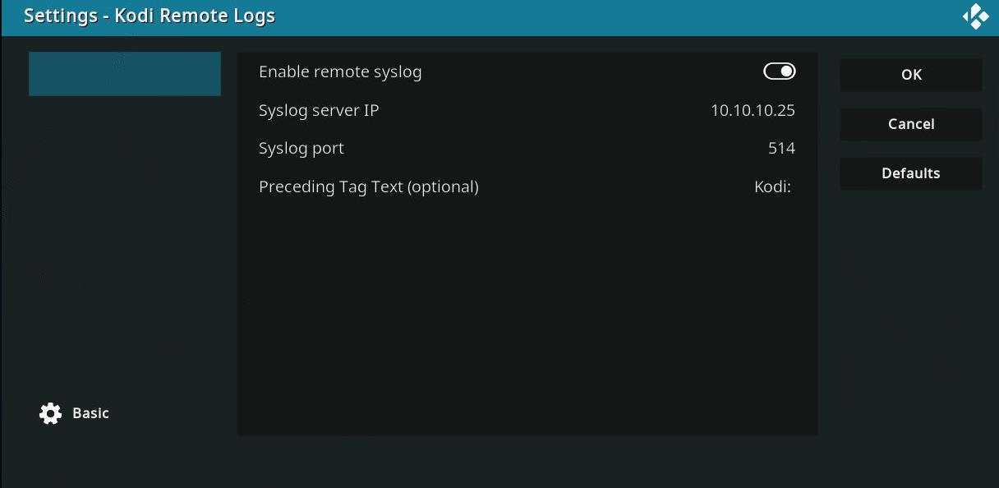

# Forward Kodi Logs 
---
This add-on is designed to read the internal log file, check every 5 seconds for new lines, and send those lines to a local syslog server via UDP.

There are just a few settings to configure. 

Forwarding can be toggled on/off.
Set the IP address of your syslog server along with its UDP port (514 default).

Tag text can be useful if you separate your log files by app name.  Spaces will be included.  This field is empty by default, though a basic use case might implement "Kodi: " for sorting purposes. 

[Download](https://github.com/calebyourison/kodi_syslog/releases/tag/kodi-syslog) and install from zip.

#### Disclaimer
---
This add-on is not part of the official repository and is not responsible for any issues that you encounter with your Kodi installation.
Please review the code if you are concerned that it may conflict with your existing system. 
This project assumes that you legally own any and all media in your library.  When in doubt, please consult applicable copyright laws.